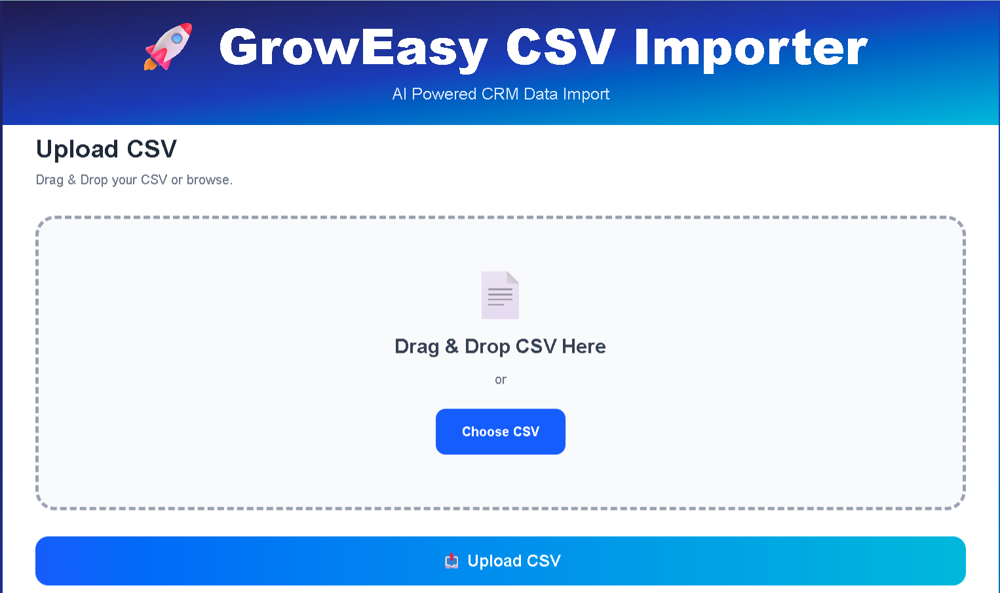
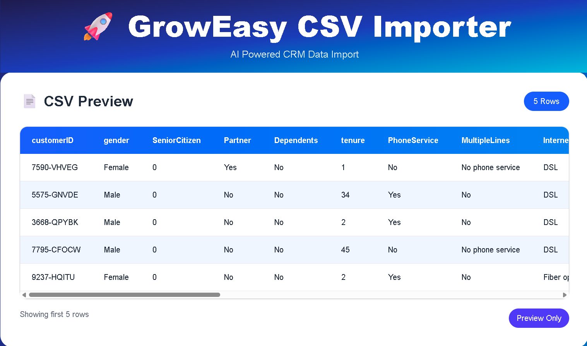

# 🚀 GrowEasy AI CSV Importer

An AI-powered CRM CSV Importer that automatically detects and maps CSV columns to CRM fields using **Google Gemini AI**. Users can review and edit the AI-generated mappings before importing the data.

---

## 🌐 Live Demo

**Frontend (Vercel):**
[https://YOUR-VERCEL-URL.vercel.app](https://groweasy-csv-importer-liart-nu.vercel.app/)

**Backend (Render):**
[https://groweasy-csv-importer-dg05.onrender.com](https://groweasy-csv-importer-dg05.onrender.com)

---

## ✨ Features

- 📤 Upload CSV files
- 👀 Preview uploaded data
- 🤖 AI-powered CRM field mapping
- ✏️ Editable field mapping
- 📥 Import data into CRM format
- 📄 Download imported data as JSON
- 📊 Download imported data as CSV
- 📱 Responsive modern UI
- ☁️ Fully deployed on Vercel & Render

---

## 🛠 Tech Stack

### Frontend
- Next.js
- React
- TypeScript
- Tailwind CSS
- Axios
- React Hot Toast

### Backend
- Node.js
- Express.js
- Multer
- Google Gemini AI
- CSV Parser

---

## 📂 Project Structure

```text
groweasy-csv-importer
│
├── Backend/
├── Frontend/
├── Screenshots/
└── README.md
```

---

## ⚙️ Installation

### Backend

```bash
cd Backend
npm install
npm start
```

### Frontend

```bash
cd Frontend
npm install
npm run dev
```

---

## 🔑 Environment Variables

### Backend

```env
GEMINI_API_KEY=YOUR_API_KEY
PORT=5000
```

### Frontend

```env
NEXT_PUBLIC_API_URL=https://groweasy-csv-importer-dg05.onrender.com
```

---

## 📸 Screenshots

### Upload CSV



### AI Field Mapping


### Imported Data Preview



### Import Success


---

## 👨‍💻 Author

**Pachcha Harshavardhan**

- GitHub: https://github.com/HarshaPachcha
